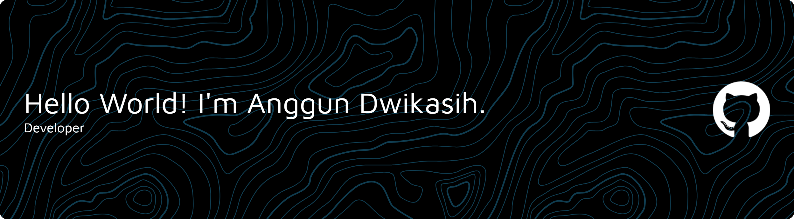

## Hi there, I'm  Anggun Dwikasih 👋

<!--
**igundw/igundw** is a ✨ _special_ ✨ repository because its `README.md` (this file) appears on your GitHub profile.

Here are some ideas to get you started:

- 🔭 I’m currently working on ...
- 🌱 I’m currently learning ...
- 👯 I’m looking to collaborate on ...
- 🤔 I’m looking for help with ...
- 💬 Ask me about ...
- 📫 How to reach me: ...
- 😄 Pronouns: ...
- ⚡ Fun fact: ...
-->
#### 🐱 About Me:
  HI everyone! My name is Anggun Dwikasih, I'm an undergraduate Computer Science student at University of North SUmatera. I'm passionate about Pyhton, Java Script, Laravel, Web Development and now I'm interested at UI/UX design, and Machine Learning.

  #### 💻 Tech Stack:

#### 🌐 Socials:

#### 📊 GitHub Stats:
 
 

### 🔝 Top Contributed Repo

---

<!-- Proudly created with GPRM ( https://gprm.itsvg.in ) -->